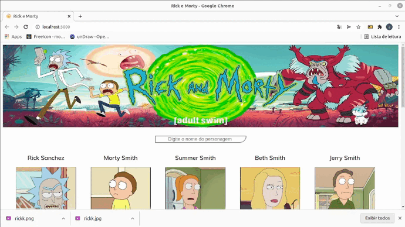

<h1>Projeto Rick e Morty</h1>

Cosumindo API publica do Rick e Morty que contém personagen , imagens dos personagens e nome dos personagens ,fazendo a busca e atualizando na tela em tempo real ultilizando hooks useState e useEffect .
